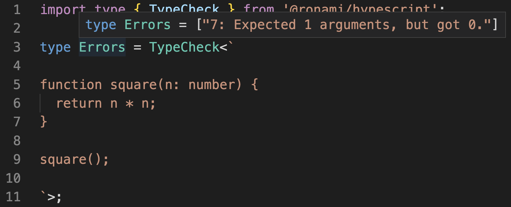

## 🐬 HypeScript

### Introduction

This is a simplified implementation of [TypeScript](https://github.com/microsoft/TypeScript)'s type system that's written in TypeScript's type annotations. This means that it uses types only — with no runtime code whatsoever.

You pass TypeScript code as a string to the `TypeCheck` generic and get possible type errors back (**[See the live demo](https://github.dev/ronami/HypeScript/blob/master/examples/simple.ts)**):



*☝ Please note that this project is meant to be used for fun and learning purposes and not for practical use.*

### Try running the code

See a live demo in your browser on the [TypeScript Playground](https://github.dev/ronami/HypeScript/blob/master/examples/simple.ts).

Alternatively, install `@ronami/hypescript` in your project with `yarn` or `npm` (TypeScript 4.7 or later is required):

```
yarn add @ronami/hypescript
```

### Code examples

Only a subset of TypeScript's syntax and features are available. Here's a list of examples (**with browser demo links**) for some code examples:

- [Variables](https://github.dev/ronami/HypeScript/blob/master/examples/variables.ts)
- [Functions](https://github.dev/ronami/HypeScript/blob/master/examples/functions.ts)
- [Arrays](https://github.dev/ronami/HypeScript/blob/master/examples/arrays.ts)
- [Objects](https://github.dev/ronami/HypeScript/blob/master/examples/objects.ts)
- [Methods](https://github.dev/ronami/HypeScript/blob/master/examples/definitions.ts)
- [Function return type](https://github.dev/ronami/HypeScript/blob/master/examples/infer-return-type.ts)
- [Equality](https://github.dev/ronami/HypeScript/blob/master/examples/equality.ts)
- [Arithmetic operations](https://github.dev/ronami/HypeScript/blob/master/examples/arithmetic.ts)
- [Global types](https://github.dev/ronami/HypeScript/blob/master/examples/globals.ts)

### Inspiration

- [TypeScripts Type System is Turing Complete](https://github.com/microsoft/TypeScript/issues/14833)
- [Functions and algorithms implemented purely with TypeScript's type system](https://github.com/ronami/meta-typing)
- [Typing the Technical Interview in TypeScript](https://gal.hagever.com/posts/typing-the-technical-interview-in-typescript/)
- [A collection of TypeScript type challenges with online judge](https://github.com/type-challenges/type-challenges)
- [Extreme Explorations of TypeScript's Type System](https://www.learningtypescript.com/articles/extreme-explorations-of-typescripts-type-system)
- [A SQL database implemented purely in TypeScript type annotations](https://github.com/codemix/ts-sql)
